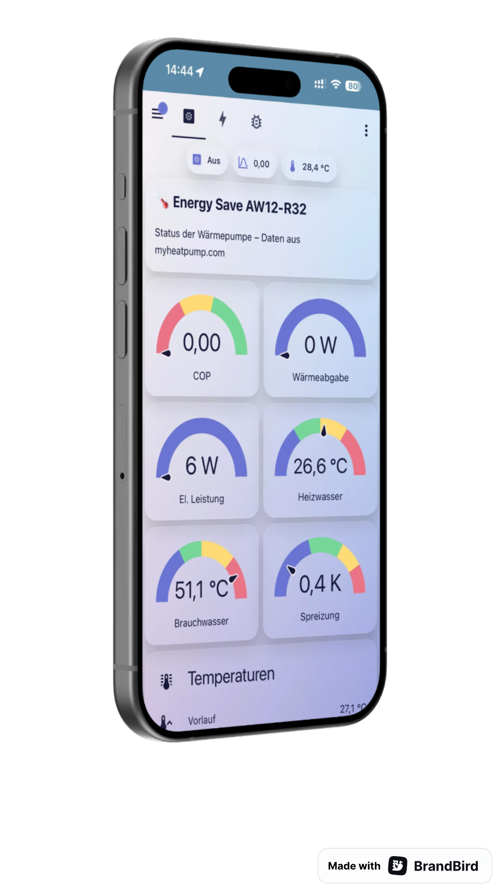

# ES Heatpump – Home Assistant Integration

[](https://hacs.xyz)
[](https://www.home-assistant.io)
[](LICENSE)
[](https://github.com/WombatFirst220/ha-es-heatpump/releases)

> 🇩🇪 [Deutsch](#-deutsch) · 🇬🇧 [English](#-english) · 📋 [Changelog](#-changelog)

<p align="center">
  
</p>

---

<a id="deutsch"></a>
## 🇩🇪 Deutsch

Home Assistant Integration für **Energy Save Wärmepumpen** (Valtop AW12-R32 u.a.) über das [myheatpump.com](https://www.myheatpump.com) Portal.

### ✨ Was die Integration leistet

- 🔐 Automatischer Login + Session-Management (Re-Login alle 55 min)
- 🔍 Automatische Geräteerkennung (`mn` + `devid` aus dem Portal)
- 📊 **Verifizierte** Sensoren mit klaren Namen (siehe [Sensor-Tabelle](#-sensoren))
- ⚡ Berechnete Werte: **Spreizung**, **Thermische Leistung**, **Aktueller COP**
- 📋 Dashboard wird automatisch in der Seitenleiste installiert
- 🧹 Saubere Entity-IDs (`sensor.es_hp_*`) — keine kryptischen Parameter-Nummern
- 🛠 Mehrsprachig: Deutsch, Englisch, Niederländisch, Schwedisch, Dänisch (Fallback auf Englisch)

### 📦 Installation via HACS

1. **HACS öffnen** → ⋮ → **Benutzerdefinierte Repositories**
2. URL: `https://github.com/WombatFirst220/ha-es-heatpump` · Kategorie: **Integration**
3. Suche nach **ES Heatpump** → **Herunterladen**
4. **Home Assistant neu starten**

### ⚡ Einrichtung

**Einstellungen → Geräte & Dienste → Integration hinzufügen → „ES Heatpump"**

| Feld | Beschreibung |
|---|---|
| **Benutzername** | E-Mail-Adresse beim myheatpump.com Portal |
| **Passwort** | Portal-Passwort |
| **Portal-URL** | Standard: `https://www.myheatpump.com` |
| **Aktualisierungsintervall** | Sekunden (10–3600, Default 60) |
| **Power-Entity** *(optional)* | Sensor mit der elektrischen Leistung (z.B. Shelly) — wird für die COP-Berechnung benötigt |
| **Volumenstrom Heizkreis** | m³/h — **unbedingt an das eigene Modell anpassen**, siehe Tabelle unten |
| **Volumenstrom Brauchwasser** *(optional)* | m³/h für den Speicherkreis (Default 1.0) |
| **Brauchwasser-Schwelle** *(optional)* | K über dem Heizen-Sollwert, ab dem auf Brauchwasser erkannt wird (Default 8) |
| **Betriebsart-Quelle** *(optional)* | Seit v2.3.0 nicht mehr nötig — nur noch als Übersteuerung, falls eine externe Entity die Betriebsart besser kennt |

Nach dem Speichern erscheinen alle Entitäten im Geräte-Eintrag, und das Dashboard **„ES Heatpump"** in der Seitenleiste.

#### ⚠️ Den Volumenstrom richtig einstellen

**Das ist die mit Abstand häufigste Fehlerquelle.** Die Wärmepumpe misst ihren
Volumenstrom nicht und meldet ihn auch nicht über das Portal. Thermische
Leistung und COP werden deshalb daraus **berechnet**:

```
P_therm [W] = Volumenstrom [m³/h] × Spreizung [K] × 1163
COP         = P_therm / elektrische Leistung
```

Ein zu niedrig eingestellter Wert macht beide Größen wertlos — und das fällt
nicht auf, weil die Zahlen plausibel aussehen. Richtwerte aus dem Datenblatt
der Serie, Zeile **„Zulässiger Wasserdurchfluss Min / Nominal"**:

| Modell | Min | **Nominal** |
|---|---:|---:|
| AWC6-R32-M-V8  | 0,65 m³/h | **1,01 m³/h** |
| AWC9-R32-M-V8  | 0,94 m³/h | **1,55 m³/h** |
| AWC12-R32-M-V8 | 1,44 m³/h | **2,02 m³/h** |
| AWC15-R32-M-V8 | 2,23 m³/h | **2,59 m³/h** |
| AWC19-R32-M-V8 | 2,66 m³/h | **3,28 m³/h** |

*(Datenblatt in l/s: 0,18/0,28 · 0,26/0,43 · 0,40/0,56 · 0,62/0,72 · 0,74/0,91 —
hier auf m³/h umgerechnet.)*

Am genauesten ist der Wert, den die Umwälzpumpe selbst anzeigt oder den der
hydraulische Abgleich festgehalten hat. Ohne diese Angabe ist der **Nominalwert**
die richtige Wahl.

**Gegenprobe:** Ein COP unter 1 ist physikalisch unmöglich — die Maschine gäbe
weniger Wärme ab, als sie Strom aufnimmt. Tritt das auf, ist der Volumenstrom zu
niedrig. Seit v2.3.0 schreibt die Integration in diesem Fall einmal pro Neustart
eine Warnung ins Log. Zur Einordnung: Bei 2,02 m³/h, 2,8 K Spreizung und 1350 W
elektrisch ergibt sich COP 4,86 — das Datenblatt nennt für eine AWC12 bei
Wasser 30/35 °C und 7 °C Außentemperatur einen COP zwischen 4,30 und 4,90.

#### 🔄 Betriebsart-Erkennung (seit v2.3.0)

Das Portal liefert kein brauchbares Betriebsart-Feld — `par15` sah danach aus,
ist aber ein Herzschlagsignal. Bis v2.2.x musste die Betriebsart deshalb aus
einer externen Hilfs-Entity kommen. Seit v2.3.0 leitet die Integration sie aus
den eigenen Werten ab, in dieser Reihenfolge:

| # | Bedingung | Betriebsart |
|---|---|---|
| 1 | keine Kompressorfrequenz in den Daten | `Unbekannt` |
| 2 | Kompressorfrequenz = 0 | `Aus` |
| 3 | Vorlauf kälter als Rücklauf (Spreizung ≤ −0,5 K) | `Entfrosten` |
| 4 | Vorlauf > Heizen-Soll + Schwelle (Default 8 K) | `Brauchwasser` |
| 5 | sonst | `Heizen` |

Entscheidend ist Regel 4: Verglichen wird gegen den **Sollwert**, nicht gegen
eine feste Temperatur. Bei Warmwasserbereitung treibt die Maschine den Vorlauf
weit über das, was der Heizkreis gerade anfordert — und das gilt für
Fußbodenheizung (Vorlauf ≈33 °C) genauso wie für Heizkörper (≈50 °C). Eine
absolute Schwelle würde bei einer der beiden Anlagenarten danebenliegen.

Regel 3 steht bewusst vor Regel 4: Beim Abtauen läuft der Kreisprozess rückwärts,
der Vorlauf kann dabei hoch sein, ohne dass Warmwasser bereitet wird.

Der Sensor `sensor.…_betriebsart` legt seine Entscheidung offen — das Attribut
`begruendung` nennt die Regel, die gegriffen hat, dazu Vorlauf, Rücklauf,
Sollwert und Frequenz. Wer die Erkennung übersteuern will, trägt weiterhin eine
`Betriebsart-Quelle` in den Optionen ein; sie hat Vorrang.

### 🌡️ Sensoren

#### ✅ Verifizierte Hauptsensoren (sichtbar by default)

| Entity-ID | par | Bedeutung | Einheit | Verifikation |
|---|---|---|---|---|
| `sensor.es_hp_aussentemp_ta` | par24 | Außentemperatur | °C | r=+1.00 ggü. Multiscrape |
| `sensor.es_hp_vorlauf_tuo`   | par4  | Vorlauftemperatur | °C | r=+0.96 |
| `sensor.es_hp_ruecklauf_tui` | par5  | Rücklauftemperatur | °C | r=+0.95 |
| `sensor.es_hp_heizen`        | par8  | Heizwasser-Temperatur | °C | r=+0.98 |
| `sensor.es_hp_heizen_soll`   | par6  | Heizen Solltemperatur | °C | Portal-Sollwert |
| `sensor.es_hp_warmwasser_tw` | par7  | Warmwasser-Temperatur | °C | Portal „Sanitary HW Tw" |
| `sensor.es_hp_raumtemperatur`| par11 | Raumtemperatur | °C | Portal „Room Temp. TR" |
| `sensor.es_hp_mischventil_1` | par9  | Mischventil 1 Temperatur | °C | Portal |
| `sensor.es_hp_aussentemp_ta` | par24 | Außentemperatur | °C | r=+1.00 |
| `sensor.es_hp_heissgas_td`   | par25 | Heißgastemperatur ⚡ neu identifiziert | °C | r=+0.998, MAD=0.35 K |
| `sensor.es_hp_frequenz_hz`   | par20 | Kompressor Frequenz | Hz | r=+0.98 |
| `sensor.es_hp_betriebsart`   | par15 | Betriebsmodus (0=Aus, 1=Heizen) | – | Portal |
| `sensor.es_hp_spannung`      | par31 | Netzspannung | V | Portal |
| `sensor.es_hp_ah_betriebszeit` | par41 | AH Betriebszeit | min | Portal-Counter |
| `sensor.es_hp_hbh_betriebszeit` | par42 | HBH Betriebszeit | min | Portal-Counter |

#### 🧮 Berechnete Sensoren

| Entity-ID | Berechnung |
|---|---|
| `sensor.es_hp_spreizung` | `Vorlauf − Rücklauf` (Δ T des Heizkreises) |
| `sensor.es_hp_thermische_leistung` | `flow_rate × Δ T × 1163 Wh/(m³·K)` — gibt 0 W aus, wenn Kompressor steht |
| `sensor.es_hp_aktueller_cop` | `Thermische Leistung / Elektr. Leistung` (benötigt Power-Entity) |

#### 🔍 Diagnose (default deaktiviert, einzeln aktivierbar)

Mischventil 2 (`par10`), Software Version (`par37`), HWTBH Betriebszeit (`par43`), sowie sieben Diagnose-Parameter (`par21`, `par22`, `par23`, `par26`, `par27`, `par39`, `par40`), die mit dem Heizzyklus korrelieren aber nicht eindeutig zuordenbar waren. Aktivierbar unter **Einstellungen → Geräte & Dienste → ES Heatpump → Entitäten**.

#### ❌ Nicht angelegt

`par1, par2, par3, par12–par19, par29, par30, par32–par36, par44–par100` — diese Parameter liefern dauerhaft `0.0` ohne erkennbaren Zusammenhang zum Anlagenzustand und werden nicht mehr als Entitäten erzeugt.

### 📋 Dashboard

<p align="center">
  
</p>

Drei Views:

1. **Übersicht** — Gauges (COP, Wärmeabgabe, El. Leistung, Heizwasser, Brauchwasser, Spreizung), Temperaturen-Tabelle, 24h-Verlauf, System-Technik
2. **Energie** — COP-Statistik (7 Tage), Wärmeabgabe + Kompressor-Frequenz, Heißgastemperatur-Verlauf, Betriebsstunden
3. **Diagnose** — Mischventile, Diagnose-Parameter, Geräteinfo

Das Dashboard-YAML wird beim Setup nach `<config>/dashboards/es_heatpump.yaml` kopiert und **bei jedem Plugin-Update überschrieben** — manuelle Änderungen an dieser Datei gehen daher verloren. Für eigene Anpassungen das Dashboard in HA duplizieren.

### 🔄 Migration von v1.x → v2.0.0

**Beim ersten Start nach dem Update** läuft eine einmalige Migration:

1. Alte Entity-IDs (`sensor.es_warmepumpe_*`) werden anhand der `unique_id` (z.B. `..._par24`) auf die neuen `sensor.es_hp_*`-IDs umgeschrieben — **History und Statistiken bleiben erhalten**.
2. Verwaiste „Parameter parXX"-Entitäten (par1, par2, …) werden aus dem Entity-Register entfernt.
3. Das Dashboard-YAML wird auf v2 überschrieben.

**Wichtig:** Wenn du Automationen oder Skripte hast, die alte Entity-IDs referenzieren, musst du diese manuell auf das neue Schema umstellen. Eine Übersicht aller Renames findest du in [`PARAMETER_MAPPING.md`](PARAMETER_MAPPING.md).

### 🐛 Fehlerbehebung

| Problem | Lösung |
|---|---|
| „Anmeldung fehlgeschlagen" | Zugangsdaten im Portal prüfen |
| Sensoren `unavailable` | Netzwerk + Portal-Erreichbarkeit prüfen, HA-Logs ansehen |
| Dashboard fehlt | `lovelace.reload_resources` aufrufen, ggf. HA-Neustart |
| Lüfter-Drehzahl fehlt | Der Lüfter-Wert ist nicht im API-Endpoint enthalten — falls benötigt, weiterhin Multiscrape verwenden |
| COP zeigt „unknown" | Power-Entity in den Optionen hinterlegen (Shelly o.ä.) |
| Falscher Wert eines Diagnose-Sensors | GitHub-Issue mit par-ID und beobachteten Werten öffnen |

---

<a id="english"></a>
## 🇬🇧 English

Home Assistant integration for **Energy Save heat pumps** (Valtop AW12-R32 and similar) via the [myheatpump.com](https://www.myheatpump.com) portal.

### ✨ Features

- 🔐 Automatic login + session management (re-login every 55 min)
- 🔍 Automatic device discovery (`mn` + `devid` from the portal)
- 📊 **Verified** sensors with clear names
- ⚡ Calculated values: **Spread (Δ T)**, **Thermal Output**, **Current COP**
- 📋 Sidebar dashboard installed automatically
- 🧹 Clean entity IDs (`sensor.es_hp_*`)
- 🛠 Multilingual UI: German, English, Dutch, Swedish, Danish (falls back to English)

### 📦 Installation via HACS

1. **HACS** → ⋮ → **Custom repositories**
2. URL: `https://github.com/WombatFirst220/ha-es-heatpump` · Category: **Integration**
3. Search **ES Heatpump** → **Download**
4. **Restart Home Assistant**

### ⚡ Setup

**Settings → Devices & Services → Add integration → "ES Heatpump"**

| Field | Description |
|---|---|
| Username | E-mail for myheatpump.com portal |
| Password | Portal password |
| Portal URL | Default `https://www.myheatpump.com` |
| Scan interval | Seconds (10–3600, default 60) |
| Power entity *(optional)* | Electrical-power sensor (e.g. Shelly) — used for COP |
| Heating-loop flow rate | m³/h — **must be set for your model**, see table below |
| DHW-loop flow rate *(optional)* | m³/h for the tank circuit (default 1.0) |
| DHW margin *(optional)* | K above the heating setpoint that marks DHW mode (default 8) |
| Operating-mode source *(optional)* | No longer needed since v2.3.0 — only as an override |

#### ⚠️ Getting the flow rate right

**This is by far the most common misconfiguration.** The heat pump neither
measures nor reports its volumetric flow, so thermal output and COP are
**calculated** from the configured value:

```
P_therm [W] = flow rate [m³/h] × spread [K] × 1163
COP         = P_therm / electrical power
```

A value that is set too low makes both figures worthless — and it goes unnoticed
because the numbers still look plausible. Reference values from the series
datasheet, row **"Permissible water flow Min / Nominal"**:

| Model | Min | **Nominal** |
|---|---:|---:|
| AWC6-R32-M-V8  | 0.65 m³/h | **1.01 m³/h** |
| AWC9-R32-M-V8  | 0.94 m³/h | **1.55 m³/h** |
| AWC12-R32-M-V8 | 1.44 m³/h | **2.02 m³/h** |
| AWC15-R32-M-V8 | 2.23 m³/h | **2.59 m³/h** |
| AWC19-R32-M-V8 | 2.66 m³/h | **3.28 m³/h** |

*(Datasheet in l/s: 0.18/0.28 · 0.26/0.43 · 0.40/0.56 · 0.62/0.72 · 0.74/0.91.)*

The most accurate figure is the one your circulation pump displays, or the one
recorded during hydraulic balancing. Without it, use the **nominal** value.

**Sanity check:** a COP below 1 is physically impossible — the machine would be
giving off less heat than the electricity it draws. If you see one, the flow
rate is too low; since v2.3.0 the integration logs a warning once per restart in
that case. For scale: 2.02 m³/h at 2.8 K spread and 1350 W electrical yields
COP 4.86, and the datasheet quotes 4.30–4.90 for an AWC12 at water 30/35 °C and
7 °C ambient.

#### 🔄 Operating-mode detection (since v2.3.0)

The portal exposes no usable operating-mode field — `par15` looked like one but
is a heartbeat signal. Up to v2.2.x the mode had to come from an external helper
entity. Since v2.3.0 it is derived from the machine's own values, in this order:

| # | Condition | Mode |
|---|---|---|
| 1 | no compressor frequency in the data | `Unbekannt` |
| 2 | compressor frequency = 0 | `Aus` (off) |
| 3 | flow colder than return (spread ≤ −0.5 K) | `Entfrosten` (defrost) |
| 4 | flow > heating setpoint + margin (default 8 K) | `Brauchwasser` (DHW) |
| 5 | otherwise | `Heizen` (heating) |

Rule 4 compares against the **setpoint**, not a fixed temperature. During hot
water production the machine drives the flow far above whatever the heating
circuit is currently asking for — true for underfloor heating (flow ≈33 °C) and
radiators (≈50 °C) alike, where a fixed threshold would misclassify one of them.

Rule 3 deliberately comes first: during a defrost cycle the refrigeration cycle
runs in reverse, and the flow temperature can be high without any DHW demand.

The `betriebsart` sensor exposes its decision — the `begruendung` attribute names
the rule that fired, alongside flow, return, setpoint and frequency. To override
the detection, configure an operating-mode source entity in the options; it takes
precedence.

### 🌡️ Sensors

The plugin creates around 18 visible entities under `sensor.es_hp_*` plus calculated sensors for **Spread**, **Thermal Output** and **COP**. Diagnostic sensors are registered but disabled by default — enable them under **Settings → Devices & Services → ES Heatpump → Entities**. Unidentified parameters that always return `0.0` are not exposed at all. See the German section above and [`PARAMETER_MAPPING.md`](PARAMETER_MAPPING.md) for the full table with verification details.

### 🔄 Migration from v1.x → v2.0.0

On first start after the update a one-time migration runs:

1. Old entity IDs (`sensor.es_warmepumpe_*`) are renamed to `sensor.es_hp_*` using their `unique_id` as the join key — **history and statistics are preserved**.
2. Orphaned "Parameter parXX" entities are removed from the registry.
3. The dashboard YAML is refreshed to v2.

Update your automations and scripts referring to the old entity IDs accordingly.

---

<a id="changelog"></a>
## 📋 Changelog

### 2.3.0 — 2026-09-21

**Betriebsart wird jetzt selbst erkannt — keine Hilfs-Entity mehr nötig.**

- Die Betriebsart wird aus den eigenen Werten der Wärmepumpe abgeleitet:
  Kompressorfrequenz (par20), Spreizung (par4 − par5) und dem Abstand des
  Vorlaufs zum Heizen-Sollwert (par4 gegen par6). Eine konfigurierte
  `mode_source_entity` hat weiterhin Vorrang, solange sie einen brauchbaren
  Wert liefert — bestehende Einrichtungen laufen unverändert weiter.
- Verglichen wird gegen den **Sollwert**, nicht gegen eine feste Temperatur.
  Dadurch funktioniert die Erkennung bei Fußbodenheizung (Vorlauf ≈33 °C) und
  bei Heizkörpern (≈50 °C) gleichermaßen; eine absolute Schwelle würde bei
  einer der beiden Anlagenarten danebenliegen.
- Neue Option **`dhw_margin_k`** (Standard 8 K): Abstand über dem Sollwert, ab
  dem auf Brauchwasser erkannt wird.
- Der Sensor `betriebsart` legt seine Entscheidung offen — Attribut
  `begruendung` nennt die Regel, die gegriffen hat, dazu Vorlauf, Rücklauf,
  Sollwert und Frequenz.
- **Plausibilitätswarnung:** Ergibt die Rechnung im Betrieb einen COP unter 1,
  schreibt die Integration einmal pro Neustart eine Warnung ins Log — das ist
  physikalisch unmöglich und bedeutet praktisch immer einen zu niedrig
  eingestellten Volumenstrom. Die Warnung nennt die Nominalwerte aus dem
  Datenblatt.
- **README:** Tabelle der Nennvolumenströme je Modell aus dem ES-Datenblatt.
- Logik in `mode.py` ausgelagert, ohne Home-Assistant-Abhängigkeit, mit
  Testfällen unter `tests/test_mode.py` (`python3 tests/test_mode.py`).

### 2.2.3 — 2026-05-19 (hotfix)

- 🐛 `_resolve_betriebsart` versteht jetzt auch Multiscrape-Outputs der Form `"Unbekannt (0.0)"` / `"Unknown (2.0)"` — die Zahl in Klammern wird extrahiert und auf die kanonische Betriebsart gemappt (`0→Aus`, `1→Brauchwasser`, `2→Heizen`, `3→Entfrosten`). Damit zeigt der Sensor auch dann „Aus" statt „Unbekannt", wenn die externe Source noch nicht alle Strings explizit liefert.

### 2.2.2 — 2026-05-19 (hotfix)

- 🩺 `sensor.es_hp_betriebsart` exponiert die nicht-`parXX`-Felder aus der Portal-Response als `api_response_meta`-Attribut. So lässt sich der gesamte Roh-Payload inspizieren, ohne im INFO-Log nach der Diagnose-Zeile zu suchen.

### 2.2.1 — 2026-05-19 (hotfix)

- 🐛 **Bugfix Betriebsart-Erkennung:** Live-Beobachtung hat gezeigt, dass `par15` **nicht** die Betriebsart liefert, sondern ein ~10-minütlich pulsendes Heartbeat-Signal ist. Bisher zeigte `sensor.es_hp_betriebsart` deshalb dauerhaft falsche Werte (z. B. „Brauchwasser" während Heizen lief).
- ✨ **Neue Option: „Betriebsart-Quelle"** im Config-Flow — externe Sensor-Entity, die die echte Betriebsart kennt (z. B. ein Multiscrape-Sensor, der das Portal-Feld „Unit Current Working Mode" aus dem HTML extrahiert). Strings wie „Heizen", „Brauchwasser", „Defrost", „1", „2" usw. werden via `BETRIEBSART_ALIASES` auf die kanonischen Enum-Werte gemappt.
- 🔁 `sensor.es_hp_betriebsart`, `sensor.es_hp_thermische_leistung` und `sensor.es_hp_aktueller_cop` lesen nun die Betriebsart aus der konfigurierten Quelle und wählen die passende Flow-Rate; ohne konfigurierte Quelle wird „Heizen" als Default angenommen (häufigster Modus).
- 🩺 **Diagnostisches Logging:** Coordinator loggt einmalig beim Start alle Nicht-`parXX`-Felder aus der Portal-Response (auf INFO-Level), damit zukünftig die echte Mode-Quelle aus der API identifiziert werden kann.
- 🧹 `par15` als `sensor.es_hp_diag_par15_heartbeat` umbenannt, default deaktiviert.

### 2.2.0 — 2026-05-18

- ✨ **Getrennte Volumenströme für Heizen und Brauchwasser.**  Die thermische Leistung und der COP werden jetzt mode-bewusst berechnet: bei Betriebsart „Heizen" (par15=2) wird der konfigurierte `flow_rate` (Heizkreislauf) genutzt, bei „Brauchwasser" (par15=1) der neue `flow_rate_dhw` (DHW-Kreislauf). Bei „Aus" und „Entfrosten" werden Thermische Leistung und COP auf 0 gesetzt — Defrost zieht zwar Strom, liefert aber keine nutzbare Wärme.
- 🔧 Neues Config-Feld **„Volumenstrom Brauchwasserkreis (m³/h)"** (Default 1.0), einstellbar im Setup-Flow und in den Optionen.
- 🌐 Übersetzungen für alle 5 unterstützten Sprachen (de · en · nl · sv · da) aktualisiert.
- 🗑️ Verifikations-Skript (`scripts/verify_mapping.py`) entfernt — nach Abschluss der Migration nicht mehr benötigt.

### 2.1.1 — 2026-05-18 (hotfix)

- 🐛 **Fix:** `dashboard.py` schreibt die Dashboard-Konfig jetzt korrekt als `{"config": <yaml>}` in `.storage/lovelace.<id>`. In v2.1.0 wurde die YAML-Struktur ohne den von HA erwarteten `config`-Wrapper gespeichert — der Frontend-Lader (`lovelace/dashboard.py:179`) warf dadurch `KeyError: 'config'` und zeigte „Unknown error" beim Dashboard-Aufruf.

### 2.1.0 — 2026-05-18

**New features**
- 🌍 **EU portal support** (closes [issue #2](https://github.com/WombatFirst220/ha-es-heatpump/issues/2)): Config-Flow URL-Feld ist jetzt ein Dropdown mit `https://www.myheatpump.com` und `https://eu.myheatpump.com` — beliebige eigene URLs sind weiterhin möglich.
- 🆕 **par36 = „Heizen Solltemperatur (manuell)"** (closes [issue #1](https://github.com/WombatFirst220/ha-es-heatpump/issues/1)): „Set temp. for Heating (without heating curve)" gemäß myheatpump.com-Settings. Sichtbar als `sensor.es_hp_heizen_soll_manuell`.
- 🔁 **Betriebsart als Text-Enum** statt nackter Zahl: `1.0 → Brauchwasser`, `2.0 → Heizen`, `3.0 → Entfrosten`, `0.0 → Aus`. Roher Zahlenwert weiterhin als `raw_value`-Attribut zugänglich.
- ⚡ **Neue Mirror-Entität `sensor.es_hp_leistung_elektrisch`**: Spiegelt die in den Optionen hinterlegte Power-Entity (z. B. Shelly) in das ES-Heatpump-Gerät — Dashboard kann sie generisch referenzieren.
- 📊 **Dashboard erweitert**: zusätzliche Gauges für elektrische Leistung & Spreizung, neue Card „Strom & Leistung", neuer 24h-Graph für elektrische Aufnahme.
- 🗣 **Mehr Sprachen**: Niederländisch (`nl`), Schwedisch (`sv`), Dänisch (`da`) — Home Assistant fällt automatisch auf Englisch zurück, wenn die HA-Sprache nicht abgedeckt ist.

### 2.0.3 — 2026-05-18 (hotfix)

- 🐛 **Fix:** Dashboard wird jetzt im **Storage-Mode** registriert statt YAML-Mode. In den Versionen 2.0.0 – 2.0.2 wurde das YAML beim Setup nach `<config>/dashboards/es_heatpump.yaml` kopiert; in manchen Setups landete die Datei aber nicht zuverlässig dort, sodass HA das Dashboard leer rendete („Neuer Abschnitt"). Im neuen Verfahren parst das Plugin das Bundle-YAML beim Setup und schreibt den Inhalt direkt in `.storage/lovelace.<id>` — damit ist die Anzeige unabhängig von Datei-Kopier-Operationen.
- 🧹 Beim Update werden Legacy-Einträge `mode: yaml` automatisch auf `mode: storage` umgestellt, die alte YAML-Datei wird entfernt.

### 2.0.2 — 2026-05-18 (hotfix)

- 🐛 **Fix:** Entity-Migration läuft jetzt **nach** `async_forward_entry_setups`, sodass auch die in v2.0.0 neu eingeführten berechneten Sensoren (`Spreizung`, `Thermische Leistung`, `Aktueller COP`) zuverlässig die `es_hp_*`-Entity-IDs bekommen. In v2.0.1 wurden sie noch mit dem Default-Slug `sensor.es_warmepumpe_*` angelegt, weil zum Migrations-Zeitpunkt noch keine Entry in der Registry existierte.

### 2.0.1 — 2026-05-18 (hotfix)

- 🐛 **Fix:** `async_migrate_entry` ergänzt. v2.0.0 setzte die Config-Schema-Version auf 2 hoch, ohne einen Migrations-Handler bereitzustellen → HA brach mit `migration_error` ab und keine Entitäten wurden geladen. Der neue Handler validiert v1-Entries einfach ohne Daten-Transformation und stempelt sie auf v2.

### 2.0.0 — 2026-05-18

**Breaking changes**
- Entity-ID prefix changed from `sensor.es_warmepumpe_*` to `sensor.es_hp_*`. A one-time migration renames existing entities by `unique_id`, preserving history. Update automations manually.

**New**
- 🧮 Calculated sensors: `es_hp_spreizung`, `es_hp_thermische_leistung`, `es_hp_aktueller_cop`
- ⚙️ Config-Flow fields for power entity (COP source) and flow rate (m³/h)
- 📊 Redesigned dashboard with 3 views (Übersicht / Energie / Diagnose)
- 📄 New `PARAMETER_MAPPING.md` documenting the correlation analysis

**Corrected mappings** (verified 2026-05-18 against multiscrape reference)
- `par25` = **Heißgastemperatur Td** (was: "Temperatur par25 — unknown") — r=+0.998
- `par21` ≠ Lüfter Drehzahl → moved to diagnostics
- `par26` ≠ Leistungsaufnahme (22 kW physically impossible) → moved to diagnostics
- `par27/par33/par34` ≠ Pumpen-Status → removed (values not binary)
- `par28` ≠ Energie gesamt → removed (no plausible kWh signal)
- `par38` removed (always 2.0)

**Removed**
- ~80 useless `Parameter parXX` entities (par1–par3, par12–par19, par44–par100) — no longer created

**Improved**
- Dashboard YAML is now re-copied on every setup, not only on first install — plugin updates push the new layout automatically
- `-99 °C` sentinel for disconnected temperature probes is filtered out (returns `None`)

### 1.5.0 and earlier

See git history.

---

## 📚 Weitere Dokumente / Further reading

- [`PARAMETER_MAPPING.md`](PARAMETER_MAPPING.md) — Detaillierte Korrelations-Analyse mit Pearson-Koeffizienten und Begründungen

## 📄 Lizenz / License

MIT
